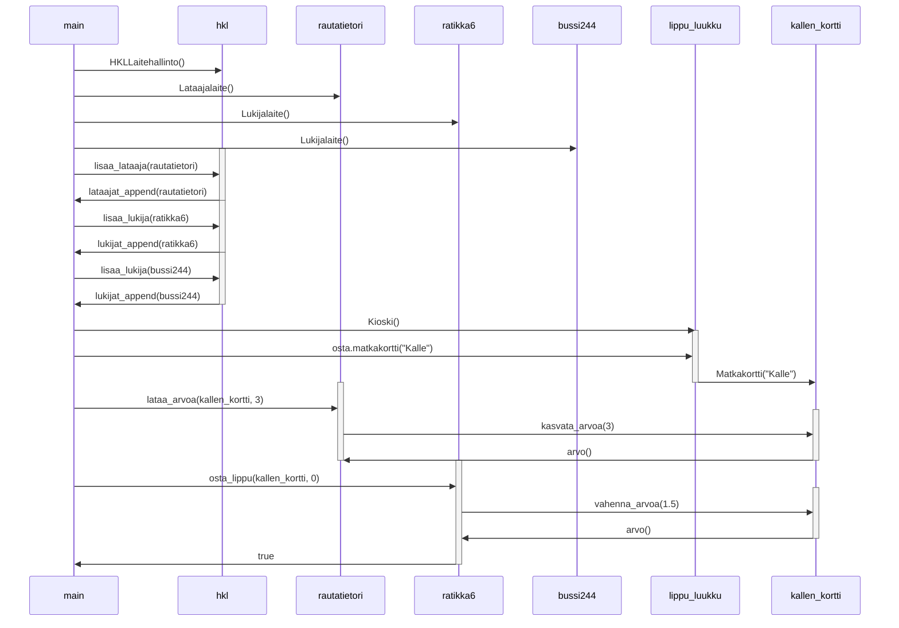

```mermaid
sequenceDiagram
    main->>hkl: HKLLaitehallinto() 
    main->>rautatietori: Lataajalaite()
    main->>ratikka6: Lukijalaite()
    main->>bussi244: Lukijalaite()
    
    activate hkl
    main->>hkl: lisaa_lataaja(rautatietori)
    hkl->> main: lataajat_append(rautatietori)
    deactivate hkl
    
    activate hkl
    main->>hkl: lisaa_lukija(ratikka6)
    hkl->> main: lukijat_append(ratikka6)
    deactivate hkl
    
    activate hkl
    main->> hkl: lisaa_lukija(bussi244)
    hkl->> main: lukijat_append(bussi244)
    deactivate hkl
    
    main->>lippu_luukku: Kioski()
    activate lippu_luukku
    main ->> lippu_luukku: osta.matkakortti("Kalle")
    lippu_luukku ->> kallen_kortti: Matkakortti("Kalle")
    deactivate lippu_luukku
    
    activate rautatietori
    main->>rautatietori : lataa_arvoa(kallen_kortti, 3)
    activate kallen_kortti
    rautatietori->>kallen_kortti: kasvata_arvoa(3)
    kallen_kortti ->> rautatietori: arvo()
    deactivate kallen_kortti
    deactivate rautatietori
    
   	activate ratikka6
   	main ->> ratikka6: osta_lippu(kallen_kortti, 0)
   	activate kallen_kortti
   	ratikka6 ->> kallen_kortti: vahenna_arvoa(1.5)
   	kallen_kortti ->> ratikka6: arvo()
   	deactivate kallen_kortti
   	ratikka6 ->> main: true
   	deactivate ratikka6
```
