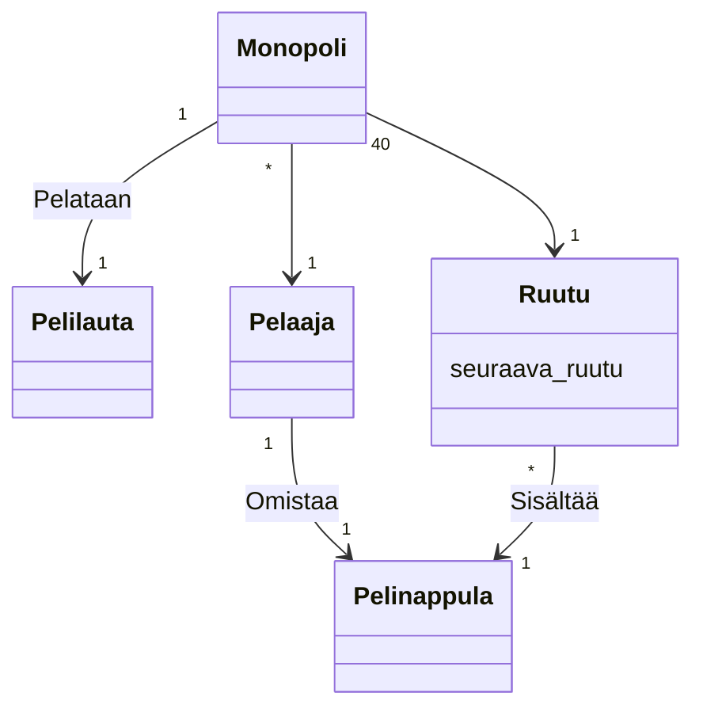

```mermaid
 classDiagram
      Monopoli "1" --> "1" Pelilauta : Pelataan
      Monopoli "*" --> "1" Pelaaja 
      Monopoli "40" --> "1" Ruutu
      Pelaaja "1" --> "1" Pelinappula : Omistaa
      Ruutu "*" --> "1" Pelinappula : Sisältää
      
      class Monopoli{
      }
      class Pelilauta{
      }
      class Ruutu{
      	seuraava_ruutu
      }
      class Pelaaja{
      }
      class Pelinappula{	
      }
```