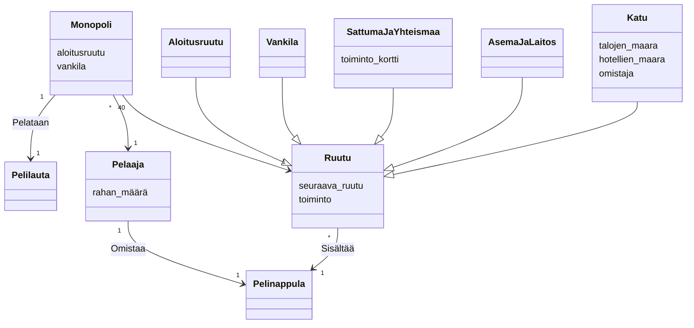

```mermaid
 classDiagram
      Monopoli "1" --> "1" Pelilauta : Pelataan
      Monopoli "*" --> "1" Pelaaja 
      Monopoli "40" --> "1" Ruutu
      Pelaaja "1" --> "1" Pelinappula : Omistaa
      Ruutu "*" --> "1" Pelinappula : Sisältää
      Aloitusruutu --|> Ruutu
      Vankila --|> Ruutu
      SattumaJaYhteismaa --|> Ruutu
      AsemaJaLaitos --|> Ruutu
      Katu --|> Ruutu
      class Monopoli{
      	aloitusruutu
      	vankila
      }
      class Pelilauta{
      }
      class Ruutu{
      	seuraava_ruutu
      	toiminto
      }
      class Pelaaja{
     	rahan_määrä
      }
      class Pelinappula{	
      }
      class Aloitusruutu{
      }
      class Vankila{
      }
      class SattumaJaYhteismaa{
        toiminto_kortti
      }
      class AsemaJaLaitos{
      }
      class Katu{
        talojen_maara
        hotellien_maara
        omistaja
      }
```