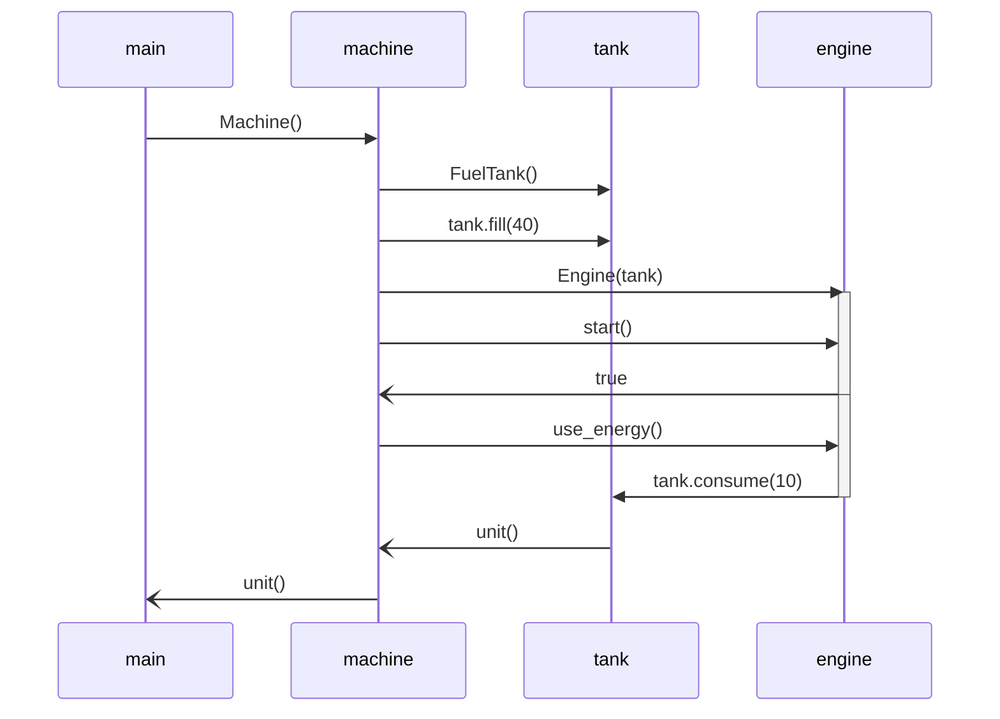

```mermaid
sequenceDiagram
    main->>machine: Machine() 
    machine->>tank: FuelTank()
    machine->>tank: tank.fill(40)
    machine->>engine: Engine(tank)
    activate engine
    machine->>engine: start()
    engine-)machine: true
    deactivate engine
    activate engine
    machine->>engine: use_energy()
    engine->>tank: tank.consume(10)
    deactivate engine
    tank-) machine: unit()
    machine-) main: unit()
```
